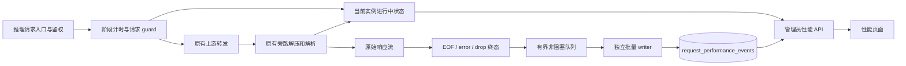

# 请求性能监控技术设计

## 1. 范围与默认决策

- 在现有管理台新增 `/performance` 页面，包含性能概览、进行中请求、慢请求明细；复用管理鉴权和现有数据库，不引入外部服务或前端依赖。
- 只监控由现有 endpoint classifier 判定为推理的 `/v1/messages` 请求，包括其本地拒绝和失败；count_tokens、遥测、健康检查和管理请求不进入模型性能统计。
- 监控默认开启，增加 `PERFORMANCE_MONITORING_ENABLED` 开关；与 `auto_telemetry`、指纹审计和 PERF_TRACE 独立。
- 拟定首版性能历史保留当前新加坡自然日及此前 29 日，默认查询最近 1 小时；原用量 ledger 的 365 日契约不变。
- 进行中列表是当前服务进程内存快照，响应携带 `instance_id`、`scope=instance`、`since_utc`，页面明确显示“当前实例”。历史来自当前数据库；共享数据库时可查看各实例历史并按 instance_id 筛选。跨实例实时汇总后续单独设计。
- 用户已于本轮回复“开工”，批准按本方案实施。

## 2. 时间与内容口径

所有耗时使用单调时钟，UTC 墙钟仅用于请求归属和查询；时间单位统一 ms，未观察到的值为 null。

| 字段 | 定义 |
| --- | --- |
| `started_at_utc` / t0 | gateway_fallback 收到推理请求时，早于 API Token 查询；并非客户端点击时间 |
| `auth_ms` | 本地凭证查询/鉴权阶段耗时 |
| `body_read_ms`、`routing_ms`、`slot_acquire_ms`、`rewrite_ms`、`resolve_token_ms` | 对已有顺序阶段分别计时；没有发生的阶段为 null |
| `upstream_headers_ms` | 发起上游 send 到收到响应头；包含网络、上游等待，不宣称能进一步拆分上游排队/预填充 |
| `first_byte_ms` | t0 到观察到首个非空上游响应 body 数据块；不将响应头记为 body 首包 |
| `first_content_ms` | t0 到首个可识别、非空的模型内容；文本、thinking、工具输入增量均可触发 |
| `first_text_ms` | t0 到首个非空正文 text；不将 thinking 或 tool use 名称冒充正文 |
| `model_completed_ms` | t0 到观察到正常 message_stop；非流式成功 JSON 在完整解析后记录，不推测其生成时间 |
| `duration_ms` | t0 到网关响应 body EOF、异常终止或 body/future drop；不在创建 Response 时结束 |
| `age_ms` | 进行中请求快照时刻减 t0 |
| `content_idle_ms` | 快照时刻减最近有效内容时刻；尚无内容时为 age_ms，并单独显示等待首内容 |
| `max_content_gap_ms` | 首内容到模型终止之间最大的无有效内容间隔；终止前尾段也纳入。首内容前等待由 first_content_ms 或未开始标志表示 |
| `output_tokens_per_second` | 成功流式请求的真实 output_tokens / 从首内容到模型结束的秒数；属于平均有效输出速度，包含思考和生成中的停顿 |

首内容允许 `content_block_start` 中实际非空文本/thinking 或非空工具输入，以及 `content_block_delta` 中非空 text_delta、thinking_delta、input_json_delta。仅有 tool id/name、空 block、signature、message_start、usage 更新、ping、注释行均不刷新内容时间。正常工具调用的 `stop_reason=tool_use` 仍可成功且首正文为空。无法识别的新内容类型保留“未知/不可观测”，不能伪造首字。

输出速度只对真实累计 output token、可观测首内容及正常终止且正生成时长的样本计算；单次批量返回、非流式 JSON、解析缺失或不完整流返回 null，不估算 Token。overview 展示有效样本速度的中位数及样本量，避免同总吞吐 TPS 混淆。

gzip/deflate/br/zstd 先旁路解压、完成 SSE 事件后才能推进内容时间；原始字节、响应头、chunk 顺序和反压不变。这是网关消费流时观察到的时刻，受客户端背压和压缩缓冲影响，不能等同于上游生成时刻或客户端屏幕显示时刻。

## 3. 数据流与模块边界

| 文件/模块 | 职责 |
| --- | --- |
| `src/model/performance.rs`（新增） | 请求阶段、终态、事件、快照、查询/聚合 DTO |
| `src/service/performance.rs`（新增） | request guard、实例 active registry、非阻塞 completion、writer/健康状态、报告服务 |
| `src/store/performance_store.rs`（新增） | 幂等批写、过滤分页、精确分位数、趋势、维度和保留清理 |
| `src/handler/router.rs` | 入口计时、鉴权路径终态、admin API 和 SPA route |
| `src/service/gateway.rs` | 阶段更新、上游 header/send error 和响应生命周期移交 |
| `src/service/usage.rs` | 扩展已有解析结果为轻量内容进展通知；解压、usage 解析只执行一次 |
| `src/store/db.rs` | SQLite/PostgreSQL 新表和幂等迁移 |
| `src/config.rs`、`src/main.rs`、各层 `mod.rs` | 关闭开关、composition root 和依赖注入 |
| `web/src/api.ts`、`web/src/router.ts`、`Dashboard.vue` | 类型、请求入口、页面和导航 |
| `web/src/components/performance/`、必要的 composable/helper | 概览、当前请求、历史列表与详情 |

独立性能服务是为了覆盖无 usage/关闭遥测/鉴权失败等路径；不改变 UsageEvent 的“可信 usage 才记账”契约。不复用 fingerprint audit 的 in_flight：该 guard 在收到响应头时已经终止。现有官方遥测 ttftMs/durationMs 字段本期保持原契约，新增本地性能字段使用明确名称。

## 4. 请求生命周期与终态

1. 在 gateway_fallback 通过已有 classifier 筛选推理请求，生成内部 UUID request_id 并登记；不把内部 ID 新增到对外响应 header。鉴权失败记录 nullable account_id/api_token_id/model，不记录原始 key。
2. guard 跨 body 读取、调度、凭证刷新和 send await 持有；已解析/校验的 account、API Token、模型信息逐步补齐。
3. 只有 `preparing`、`waiting_upstream`、`waiting_content`、`thinking`、`text`、`tool`、`finishing` 等可证实阶段；细分准备步骤用阶段计时字段表达。并发槽不足目前立即拒绝，不能虚构本地排队阶段。
4. 成功返回 Response 时，把唯一终态所有权移交到响应 body 的 stream/guard；响应构造成功不 finalize。内容进展句柄可共享，但不能多次完成同一请求。
5. 原有 usage observer 的 early-finalize 或解析失败不能提前终止性能生命周期。性能解析失败设置 observation_quality，仍持续观测原始字节及最终 EOF/error/drop。
6. 正常 SSE 的 message_stop 记录模型终点；body EOF 才释放本地请求生命周期。无 message_stop 的 EOF 标记 incomplete；SSE error 即使 HTTP 200 也标记 stream_error。非流式成功 JSON 在完整 EOF 与可识别成功响应后标记成功，无 usage 本身不是错误。
7. reqwest send/read 错误按 typed error 区分 timeout 和普通传输错误；保留上游 HTTP 状态与下游 HTTP 状态的区别。解析不受支持/失败而无法判断完整性时标记 unknown，不把 HTTP 200 当成功证据。
8. 429/5xx 的终态跟随已包装的下游响应，不等待后台 usage drain；该 drain 不得重新标记当前请求活跃或覆盖终态，也不计入用户等待耗时。
9. future/body drop 且无更明确错误时记 aborted（取消或响应被释放），不能声称能够精确区分客户端断连、服务端取消或关闭。在已观察到协议终点但 EOF 前 drop 时保留 `model_completed_ms` 和 aborted 结果，避免丢失事实。
10. 终态移除 active registry 项并 `try_send` 一条不可变事件；UUID 唯一键及一次性 guard 防止重复落库。disabled 分支不登记、不写库。

持久终态集合：success、local_error、http_error、send_error、send_timeout、read_timeout、stream_error、incomplete、aborted、unknown；HTTP status、safe error category 和 observation_quality 单独保存。分母明确：completed_count 是全部已结束请求；error_count 排除 aborted/unknown；取消和未知各自展示。未完成请求只在 active 页面呈现，不混入零耗时样本。

## 5. 存储、容量和统计

新表 `request_performance_events` 与 usage ledger 独立，无级联外键。实现采用类型化 PerformanceEvent 的完整 JSON 快照 + 用于筛选/统计的固定投影列，同一事务写入；UTC 时间在快照为 RFC3339，在查询列为 epoch milliseconds，SQLite/PG 共用数值范围条件：

- 唯一内部 request_id、instance_id；started_at_utc、completed_at_utc、sg_day。
- nullable account_id/api_token_id/request_model/response_model，上游 request_id 仅在管理员明细中按现有管理鉴权访问，不进入普通 info 日志。
- streaming 标志、上下游状态码、outcome、safe error category、observation_quality、stop_reason。
- 第 2 节各阶段耗时/首包/首内容/首正文/模型结束/完整耗时/max gap、真实 output_tokens 和有效速度。
- 初始索引：request_id primary key、(sg_day, started_at_ms)、(account_id, sg_day)、(api_token_id, sg_day)、(model, sg_day)；duration_desc 在已限制日期范围内排序，验证查询计划后才增加更多索引。

当前实现将 schema v3 升至 v4；新建库和升级库都创建 SQLite/PG 表与索引，全部成功后才 stamp。上线前检查是否已有其他任务占用 v4，并顺延，禁止覆盖版本。

复用同一个 AnyPool。完成事件队列容量 4096，独立 writer 最多 128 条或 200ms 批写；有界重试后统计丢弃。active registry 上限初始 10000，超限时请求照常转发并计 active_tracking_dropped；不可静默淘汰仍在运行的项。不逐 token/chunk 落库或发送异步消息，每请求只保存少量时间戳和状态。

健康响应包含 queue_depth、persisted_total、dropped_total、write_failed_total、active_tracking_dropped、parse_failed_total 和 since_utc；页面出现缺口时明确提示，不能把监控故障显示成“零请求”。进程崩溃会丢失内存 active 和未刷盘事件，本期不做崩溃恢复追踪，历史不能宣称完整。

历史归属使用 started_at_utc，新加坡日期筛选与现有用量页一致。保留边界以请求开始日计算；完成时已超出保留窗口的事件不入库并计 retention_expired_total，避免清理后迟到重插。低频批量删除过期性能记录，不影响用量数据。

延迟聚合按有效非空值计算相同口径的 nearest-rank 分位数（rank=ceil(p*N)），两种数据库采用窗口函数/排序选位在数据库内完成，不把全量样本读入应用内存。每个指标分别返回 sample_count；默认延迟趋势/分位数使用完整成功请求，失败/取消/未知计数同时展示，历史明细可查看其耗时。不对已有 P95 求平均生成全局 P95。

duration 和 first-content 直方图区间：<1s、1–5s、5–15s、15–60s、1–5min、5–15min、15–30min、>=30min。分页 page_size 默认 20、上限 100；查询范围限制在保留窗口内，最多 30 个新加坡自然日；趋势最多 288 个桶（按范围选择 1min/5min/1h/1day）。默认 1 小时按时间精确过滤，不只按 sg_day 扫描。

## 6. 管理 API 与界面

所有 API 放在既有 admin_auth 保护下，字段 snake_case。输入只能使用校验过的 enum/时间/数字参数，SQL 参数绑定。

| API | 功能 |
| --- | --- |
| `GET /admin/performance` | 时间范围、账号、API Token、模型、instance 过滤后的 summary、趋势、直方图及监控健康状态 |
| `GET /admin/performance/active` | 当前实例活跃列表，按 age_ms 倒序分页；返回 scope/instance_id/since_utc/generated_at_utc |
| `GET /admin/performance/requests` | 同维度 + outcome/stream/min_duration_ms 筛选，created_at_desc 或 duration_desc，返回 PagedResult |
| `GET /admin/performance/requests/:request_id` | 单请求阶段时间和结果；不返回正文、凭证或内部堆栈 |
| `GET /admin/performance/dimensions` | 性能数据自身的安全筛选项，包含无 usage 的失败请求维度；删除对象以 ID 回退显示 |

默认时间范围最近 1 小时；支持今天和最近 24 小时/7 天/30 天。UI 时间与既有新加坡日期规则一致。概览展示首内容/首正文/完整耗时 P50/P95/P99、最大值、样本数、有效输出速度、失败/取消/未知计数；首包与阶段耗时在详情中展开。

active 每 5 秒刷新，概览每 60 秒刷新，历史明细首次/筛选/手动刷新时查询；页面隐藏时暂停轮询，卸载时清理 timer/AbortController。取消旧查询防止乱序覆盖；失败保留最近有效结果并显示更新时间与错误，不能置零。

Vue 使用现有 `<script setup lang="ts">`、Composition API、UI primitives 和现有 SVG 图表方式，不引入图表包。active 中暂无正文显示“未产生正文”，工具调用/思考显示实际阶段。未知或不适用数据一律 `—` 并给出原因。该版本提供诊断和排序，告警策略、通知渠道与自动处置不属于本期。

## 7. 验证和回滚

- 以本地 mock 上游和可控时间覆盖心跳、思考/正文、tool-only、压缩 chunk、EOF/error/drop/超时、包装错误等场景，验证原始 body 一致与槽位不泄漏。
- 人工浏览器检查一条持续心跳请求在结束前可见，之后可在历史中找到同 request_id；检查移动布局、分页/筛选、错误保留与 `/performance` 直接刷新。
- SQLite 真实临时库测试 fresh/v3 migration、重复迁移、批写、精确分位数、过滤/分页和清理；PG 分支静态核对并在测试实例可用时实际 smoke 验证，未运行时明确记录。
- 不触碰真实 Anthropic、生产数据库或现有线上超时。先关闭性能采集可停止新增写入；回滚应用时保留新表，旧版无新表依赖，不执行破坏性 down migration。

## 8. 实现确认

- 生命周期外层使用保留 HTTP frame、trailers 和 size_hint 的 Body 包装器；已有 usage observer 只提供解析通知，不重复解压。
- API 查询以 RFC3339 `start_at/end_at` 接受时间；报告返回 `start_ms/end_ms`；时间指标对象包含 `sample_count/p50/p95/p99/max`，其中时间字段单位 ms、output_speed 单位 tok/s。
- 阶段用 `stages_ms` 固定 key 字典表达；outcome 为安全错误类别，不保存外部错误文本。不存在额外任意 error 字符串列。
- Vue 组件图：Performance 为组合入口；PerformanceFilters 接收 dimensions 与 filters 双向模型；PerformanceOverview 接收 report；PerformanceRequests 接收列表/维度/loading，发出 page/select；PerformanceDetail 接收 event/error，发出 close。usePerformance 独立管理查询、轮询、取消与失败保留。
- PostgreSQL 实测暴露 SQLx Any 0.7 的 NULL 类型丢失与 QueryBuilder 问号占位符问题。固定类型哨兵经 NULLIF 还原 NULL，并将仅由 push_bind 产生的问号编号为两种数据库均支持的 `$n`。新增独立 PG 回归验证与 SQLite 相同样本。
